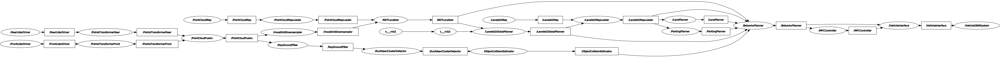

# reference-system-autoware

With the distributed development of ROS across many different organizations it is sometimes hard to benchmark and concretely show how a certain change to a certain system improves or reduces the performance of that system.  For example did a change from one executor to another actually reduce the CPU or was it something else entirely?

In order to try and address this problem we at [Apex.AI](https://apex.ai) would like to propose a definition of a reference system that simulates a real world scenario - in this case Autoware.Auto and its lidar data pipeline - that can be repeated no matter the underlying change of any piece of the full stack (i.e. executor, DDS or even RMW).



Future reference systems could be proposed that are more complex using the same basic node building blocks developed for this first scenario.

## Supported Platforms

To enable as many people as possible to replicate this reference system, the platform(s) were chosen to be easily accessible (inexpensive, high volume), has lots of documentation / community use and will be supported well into the future.

Platforms were not chosen for performance of the reference system - we know we could run “faster” with a more powerful CPU or GPU but then it would be harder for others to validate findings and test their own configurations.  Accessibility is the key here and will be considered if more platforms want to be added to this benchmark list.

**Platforms:** 
 - [Raspberry Pi 4 B](https://www.raspberrypi.org/products/raspberry-pi-4-model-b/) 4 GB running the [real-time linux kernel](https://github.com/ros-realtime/rt-kernel-docker-builder)


*Note: create an [issue](https://github.com/ros-realtime/reference-system-autoware/issues/) to add more platforms to the list, keeping in mind the above criteria*

## Concept Overview

Rather than trying to write code to cover all potential variations of executors, APIs, and future features we cannot even imagine today, we have chosen instead to define what we call a “reference system” based on part of a real-world system, [Autoware.Auto](https://www.autoware.org/autoware-auto).

The above node graph can be boiled down to only a handful of node "types" that are repicated to make this complex system:

**Node Types:**

1. [**Sensor Node**](reference_system_autoware/include/reference_system_autoware/node/sensor.hpp)
    - input node to system
    - publishes message cyclically at some fixed frequency
2. [**Processing Node**](reference_system_autoware/include/reference_system_autoware/node/processing.hpp)
    - one subscriber, one publisher
    - starts processing for N milliseconds after a message is received
    - publishes message after processing is complete
3. [**Fusion Node**](reference_system_autoware/include/reference_system_autoware/node/fusion.hpp)
    - N subscribers, one publisher
    - starts processing for N milliseconds after a message is received **from all** subscriptions
    - publishes message after processing is complete
4. [**Reactor Node**](reference_system_autoware/include/reference_system_autoware/node/reactor.hpp)
    - N subscribers, one publisher
    - starts processing for N milliseconds after a message is received **from any** single subscription
    - publishes message after processing is complete
5. [**Command Node**](reference_system_autoware/include/reference_system_autoware/node/command.hpp)
    - prints output stats everytime a message is received

These basic building-block nodes can be mixed-and-matched to create quite complex systems that replicate real-world scenarios to benchmark different configurations against each other.

## Reference Systems Overview

The first reference system benchmark proposed is based on the *Autoware.Auto* lidar data pipeline as stated above and shown in the node graph image above as well.

1. **Reference System Autoware.Auto**
    - ROS2:
        - Executors:
            - Default:
                - [Single Threaded](reference_system_autoware/src/ros2/executor/autoware_default_multithreaded.cpp)
                - [Multithreaded](reference_system_autoware/src/ros2/executor/autoware_default_multithreaded.cpp)

Results below show various characteristics of the same simulated system (Autoware.Auto).

To add your own executor / middleware / configuration to the list above follow the *Contributing* section below.

## Benchmark Results

Results are kept in the [results directory](results) and can be updated via a PR by anyone who has a supported platform listed above after following the steps below to generate them.

### Generating Results

Tests are provided to automatically generate results for you by running `colcon test` on a supported platform above.

To run the test, simply run the following command from your workspace:

```
colcon test  --packages-up-to reference_system_autoware
```

Alternatively if for some reason you do not or cannot use `colcon` the tests are simple `gtests` that can be ported and ran on any configuration.


## Contributing

If you see a missing configuration on the list above that you would like to see benchmarked against please follow the steps below to request it to be added.

- look over the open / closed [issues](https://github.com/ros-realtime/reference-system-autoware/issues/) to make sure there isn't already an open ticket for the configuration you are looking for
- 


