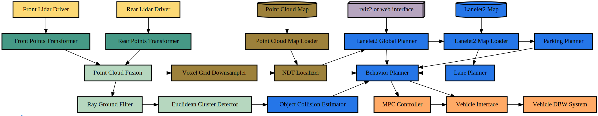

# autoware_reference_system

This file is meant to define the Autoware Reference System and all of its nodes, topics and message types.

## Message Types

A **single message type** is used for the entire _reference system_ when generating results in order to simplify the setup as well as make it more repeatible and extensible.

This means **only one _message type_** from the list below is used during any given experimental run for every node in the reference system.

1. [**Message4kB**](../reference_interfaces/msg/Message4kB.idl)
    - reference message with a fixed size of 4 kilobytes (kB)

Other messages with different fixed sizes could be added here in the future.

When reporting results it will be important to include the _message type_ used duing the experiement so that comparisons can be done "apples to apples" and not "apples to pears".

## Reference System Autoware

Built from [a handful of building-block node types](../README.md#concept-overview), each one of these nodes are meant to simulate a real-world node from the Autoware.Auto project lidar data pipeline.

Under each node type are the requirements used for _this specific reference system_, `reference_system_autoware`. Future reference systems could have slightly different requirements and still use the same building-block node types.

For simplicity's sake, every node except for the _command nodes_ only ever publishes one topic and this topic has the same name as the node that publishes it. However, each topic can be subscribed to by multiple different nodes.

1. [**Message Type**](#message-types)
    - all nodes use the same message type during any single test run
    - default _message type_:
        - [Message4kB](../reference_system/include/reference_system/msg_types.hpp#L21)
    - to be implemented:
        - Message64kB
        - Message256kB
        - Message512kB
        - Message1024kB
        - Message5120kB
2. [**Sensor Nodes**](../reference_system/include/reference_system/nodes/rclcpp/sensor.hpp)
    - all _sensor nodes_ have a publishing rate (cycle time) of [**100 milliseconds**](include/reference_system/system/timing/default.hpp#L26)
    - all _sensor_nodes_ publish the same _message type_
    - total of **5 _sensor nodes_**:
        - [Front Lidar Driver](include/autoware_reference_system/autoware_system_builder.hpp#L38)
        - [Rear Lidar Driver](include/autoware_reference_system/autoware_system_builder.hpp#L44)
        - [Point Cloud Map](include/autoware_reference_system/autoware_system_builder.hpp#L50)
        - [rviz2](include/autoware_reference_system/autoware_system_builder.hpp#L56)
        - [Lanelet2Map](include/autoware_reference_system/autoware_system_builder.hpp#62)
3. [**Processing Nodes**](../reference_system/include/reference_system/nodes/rclcpp/processing.hpp)
    - all _processing nodes_ have one subscriber and one publisher
    - all _proccing nodes_ start processing for [**50 milliseconds**](include/autoware_reference_system/system/timing/default.hpp#L28) after a message is received
    - publishes message after processing is complete
    - total of **10 _processing nodes_:**
        - [Front Points Transformer](include/autoware_reference_system/autoware_system_builder.hpp#L69)
        - [Rear Points Transformer](include/autoware_reference_system/autoware_system_builder.hpp#L78)
        - [Voxel Grid Downsampler](include/autoware_reference_system/autoware_system_builder.hpp#L87)
        - [Point Cloud Map Loader](include/autoware_reference_system/autoware_system_builder.hpp#L96)
        - [Ray Ground Filter](include/autoware_reference_system/autoware_system_builder.hpp#L105)
        - [Euclidean Cluster Detector](include/autoware_reference_system/autoware_system_builder.hpp#L114)
        - [Object Collision Estimator](include/autoware_reference_system/autoware_system_builder.hpp#L123)
        - [MPC Controller](include/autoware_reference_system/autoware_system_builder.hpp#L132)
        - [Parking Planner](include/autoware_reference_system/autoware_system_builder.hpp#L141)
        - [Lane Planner](include/autoware_reference_system/autoware_system_builder.hpp#L150)
4. [**Fusion Nodes**](../reference_system/include/reference_system/nodes/rclcpp/fusion.hpp)
    - all _fusion nodes_ have **two subscribers** and one publisher for this _reference system_
    - all _fusion nodes_ start processing for [**25 milliseconds**](include/autoware_reference_system/system/timing/default.hpp#L30) after a message is received **from all** subscriptions
    - publishes message after processing is complete
    - total of **5 _fusion nodes_:**
        - [Point Cloud Fusion](include/autoware_reference_system/autoware_system_builder.hpp#L160)
        - [NDT Localizer](include/autoware_reference_system/autoware_system_builder.hpp#L169)
        - [Vehicle Interface](include/autoware_reference_system/autoware_system_builder.hpp#L178)
        - [Lanelet2 Global Planner](include/autoware_reference_system/autoware_system_builder.hpp#L187)
        - [Lanelet 2 Map Loader](include/autoware_reference_system/autoware_system_builder.hpp#L196)
5. [**Reactor Nodes**](../reference_system/include/reference_system/nodes/rclcpp/reactor.hpp)
    - for this _reference system_ there is onle [**1 _reactor node_**](include/autoware_reference_system/autoware_system_builder.hpp#L206)
    - this _reactor node_ has **6 subscribers**and one publisher
    - this _reactor node_ starts processing for [**1 millisecond**](include/autoware_reference_system/system/timing/default.hpp#L32) after a message is received **from any** single subscription
    - publishes message after processing is complete
6. [**Command Nodes**](../reference_system/include/reference_system/nodes/rclcpp/command.hpp)
    - for this _reference system_ there is onle [**1 _command node_**](include/autoware_reference_system/autoware_system_builder.hpp#L217)
    - this _command node_ has **1 subscriber** and zero publishers
    - this _command node_ prints out the final latency statistics after a message is received on the specified topic