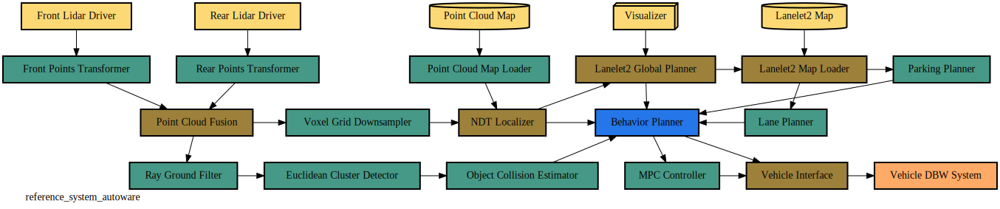

# autoware_reference_system

This file is meant to define the Autoware Reference System and all of its nodes, topics and message types.



To get started and test this system yourself, head down to [the _Quick Start section_](#quick-start) and follow the instructions there.

_See the [generating a node graph](#generate-node-graph) using graphviz section on how to generate the above image_

## Evaluation Criteria

The _autoware reference system_ was made with a few goals in mind. See the list below to get the complete picture of why certian tests are run and why this system was chosen as a good system to benchmark different executors.

Each item below should have a corresponding test report with it or be able to be extracted from an existing test report. See the [testing](#running-the-tests) section for more details on how to generate your own test reports.

If you believe we are missing another metric to measure executors by, please create an issue and let us know!

### **Key Performance Indicators (KPIs)**

- **CPU utilization**
    - In general a lower CPU utilization is better since it enables you to choose a smaller CPU or have more functionality on a larger CPU for other things.
    - **The lower CPU utilization the better**
- **Memory utilization**
    - In general a lower memory utilization is better since it enables you to choose a smaller memory or have more space for other things
    - **The lower memory utilization the better**
- **Use latest samples, count dropped samples**
    - This is representative of the real-world where old sensor data is much less valuable than new sensor data
        - For example an image from 30 seconds ago wont help you to drive down the road as much as an image from 0.1 seconds ago)
    - If there is more than one new sample, the old ones will be dropped in favor of the newest sample
    - As a result, dropped messages may mean that information was lost
        - Fusion Nodes may drop messages by design if their inputs have different frequencies, do not count dropped messages for these nodes
        - Transform nodes should not drop messages though, and these should be counted
    - **The lower number of dropped samples the better**
- **Every Front Lidar sample should cause update in Object Collision Estimator**
    - The Front and Rear Lidars have the same publishing frequency
    - This means Object Collision Estimator should run for every lidar sample
    - Count number of executions of Object Collision Estimator and Front Lidar and report any difference
    - **The smaller the difference in executions, the better**
- **Lowest possible latency from Front Lidar to Object Collision Estimator**
    - As in the real world, we want to know as soon as possible if the reference system will collide with something
    - Measure the mean and max latency for this chain of nodes
    - **The lower latency of the signal chain the better**
- **The Behavior Planner should be as cyclical as possible**
    - The desired behavior of the Behavior Planner is to be as cyclical as possible, meaning it should be executed as close to its set frequency of _100ms_ as possible
    - Measure the jitter and drift over time of the timer callback
    - **The lower the jitter and drift of the Behavior Node timer callback the better**


## Message Types

A **single message type** is used for the entire _reference system_ when generating results in order to simplify the setup as well as make it more repeatible and extensible.

This means **only one _message type_** from the list below is used during any given experimental run for every node in the reference system.

1. [**Message4kB**](../reference_interfaces/msg/Message4kb.idl)
    - reference message with a fixed size of 4 kilobytes (kB)

Other messages with different fixed sizes could be added here in the future.

When reporting results it will be important to include the _message type_ used duing the experiement so that comparisons can be done "apples to apples" and not "apples to pears".

## Autoware Reference System

Built from [a handful of building-block node types](../README.md#concept-overview), each one of these nodes are meant to simulate a real-world node from the Autoware.Auto project lidar data pipeline.

Under each node type are the requirements used for _this specific reference system_, `autoware_reference_system`. Future reference systems could have slightly different requirements and still use the same building-block node types.

For simplicity's sake, every node except for the _command nodes_ only ever publishes one topic and this topic has the same name as the node that publishes it. However, each topic can be subscribed to by multiple different nodes.

1. [**Message Type**](#message-types)
    - all nodes use the same message type during any single test run
    - default _message type_:
        - [Message4kB](../reference_system/include/reference_system/msg_types.hpp#L21)
    - to be implemented:
        - Message64kB
        - Message256kB
        - Message512kB
        - Message1024kB
        - Message5120kB
2. [**Sensor Nodes**](../reference_system/include/reference_system/nodes/rclcpp/sensor.hpp)
    - all _sensor nodes_ have a publishing rate (cycle time) of [**100 milliseconds**](include/reference_system/system/timing/default.hpp#L26)
    - all _sensor_nodes_ publish the same _message type_
    - total of **5 _sensor nodes_**:
        - [Front Lidar Driver](include/autoware_reference_system/autoware_system_builder.hpp#L38)
        - [Rear Lidar Driver](include/autoware_reference_system/autoware_system_builder.hpp#L44)
        - [Point Cloud Map](include/autoware_reference_system/autoware_system_builder.hpp#L50)
        - [Visualizer](include/autoware_reference_system/autoware_system_builder.hpp#L56)
        - [Lanelet2Map](include/autoware_reference_system/autoware_system_builder.hpp#62)
3. [**Transform Nodes**](../reference_system/include/reference_system/nodes/rclcpp/transform.hpp)
    - all _transform nodes_ have one subscriber and one publisher
    - all _transform nodes_ start processing for [**50 milliseconds**](include/autoware_reference_system/system/timing/default.hpp#L28) after a message is received
    - publishes message after processing is complete
    - total of **10 _transform nodes_:**
        - [Front Points Transformer](include/autoware_reference_system/autoware_system_builder.hpp#L69)
        - [Rear Points Transformer](include/autoware_reference_system/autoware_system_builder.hpp#L78)
        - [Voxel Grid Downsampler](include/autoware_reference_system/autoware_system_builder.hpp#L87)
        - [Point Cloud Map Loader](include/autoware_reference_system/autoware_system_builder.hpp#L96)
        - [Ray Ground Filter](include/autoware_reference_system/autoware_system_builder.hpp#L105)
        - [Object Collision Estimator](include/autoware_reference_system/autoware_system_builder.hpp#L123)
        - [MPC Controller](include/autoware_reference_system/autoware_system_builder.hpp#L132)
        - [Parking Planner](include/autoware_reference_system/autoware_system_builder.hpp#L141)
        - [Lane Planner](include/autoware_reference_system/autoware_system_builder.hpp#L150)
4. [**Fusion Nodes**](../reference_system/include/reference_system/nodes/rclcpp/fusion.hpp)
    - all _fusion nodes_ have **two subscribers** and one publisher for this _reference system_
    - all _fusion nodes_ start processing for [**25 milliseconds**](include/autoware_reference_system/system/timing/default.hpp#L30) after a message is received **from all** subscriptions
    - all _fusion nodes_ have a max input time difference between the first input received and last input received before publishing of [**9999** seconds](include/autoware_reference_system/system/timing/benchmark.hpp)
    - publishes message after processing is complete
    - total of **5 _fusion nodes_:**
        - [Point Cloud Fusion](include/autoware_reference_system/autoware_system_builder.hpp#L160)
        - [NDT Localizer](include/autoware_reference_system/autoware_system_builder.hpp#L169)
        - [Vehicle Interface](include/autoware_reference_system/autoware_system_builder.hpp#L178)
        - [Lanelet2 Global Planner](include/autoware_reference_system/autoware_system_builder.hpp#L187)
        - [Lanelet 2 Map Loader](include/autoware_reference_system/autoware_system_builder.hpp#L196)
5. [**Cyclic Nodes**](../reference_system/include/reference_system/nodes/rclcpp/cyclic.hpp)
    - for this _reference system_ there is only [**1 _cyclic node_**](include/autoware_reference_system/autoware_system_builder.hpp#L206)
    - this _cyclic node_ has **6 subscribers**and one publisher
    - this _cyclic node_ starts processing for [**1 millisecond**](include/autoware_reference_system/system/timing/default.hpp#L32) after a message is received **from any** single subscription
    - publishes message after processing is complete
6. [**Command Nodes**](../reference_system/include/reference_system/nodes/rclcpp/command.hpp)
    - all _command nodes_ have **1 subscriber** and zero publishers
    - all _command nodes_ prints out the final latency statistics after a message is received on the specified topic
    - total of **2 _command nodes_:**
        - [VehicleDBWSystem](include/autoware_reference_system/autoware_system_builder.hpp#L222)
        - [IntersectionOutput](include/autoware_reference_system/autoware_system_builder.hpp#L227)
7. [**Intersection Nodes**](../reference_system/include/reference_system/nodes/rclcpp/intersection.hpp)
    - for this _reference system_ there is only [EuclideanClusterDetector](include/autoware_reference_system/autoware_system_builder.hpp#L206)
    - this _intersection node_ has **2 subscribers** and **2 publishers**
    - publishes message after processing is complete on the correspoding publisher


## Quick Start

This section will go over how to clone, build and run the `autoware_reference_system` in order to generate your own test reports.

### Dependencies

Before running the tests there are a few prerequisites to complete:

- Install python depedencies used during test runs and report generation
    - `python3 -m pip install psrecord bokeh networkx numpy pandas`
- Install dependencies using the following command from the `colcon_ws` directory:
    - `rosdep install --from-paths src --ignore-src -y`
- Install LTTng and `ros2_tracing` [following the instructions in `ros2_tracing`](https://gitlab.com/ros-tracing/ros2_tracing#building)
   - _Note:_ if you are setting up [ a realtime linux kernel for a raspberry pi using this docker file](https://github.com/ros-realtime/rt-kernel-docker-builder#raspberry-pi-4-rt-linux-kernel), it should [already include LTTng](https://github.com/ros-realtime/rt-kernel-docker-builder/pull/18)
   - _Note:_ make sure to clone `ros2_tracing` into **the same workspace as where you put the `reference-system`**, the tests will not properly run if they are not in the same directory.

**Tests will fail** if any of the above dependencies are missing on the machine.

Once the above steps are complete you sould be ready to configure the setup for your platform and run the tests to generate some results.

## Configure Processing Time

Many nodes in the reference system are actually performing some _psuedo work_ by finding prime numbers up until some _maximum value_.  Depending on the platform, this _maximum value_ will need to be changed so that these nodes do not take an absurd amount of time.  This _maximum value_ should be chosen on a platform-by-platform basis so that the total _run time_ of this work takes some desired length of time.

In order to make finding this _maximum value_ a bit easier across many different platforms a simple [**number_cruncher_benchmark**](src/ros2/number_cruncher_benchmark.cpp) is provided that will loop over various _maximum values_ and spit out how long each one takes to run.  After running this executable on your platform you should have a good idea what _maximum value_ you should use in your [timing configuration](include/autoware_reference_system/system/timing/default.hpp) so that each node does some measurable work for some desired amount of time.

Here is an example output of the `number_cruncher_benchmark` run on a typical development platform (Intel 9i7):

```
ros2 run autoware_reference_system number_cruncher_benchmark 
maximum_number     run time
          64       0.001609ms
         128       0.002896ms
         256       0.006614ms
         512       0.035036ms
        1024       0.050957ms
        2048       0.092732ms
        4096       0.22837ms
        8192       0.566779ms
       16384       1.48837ms
       32768       3.64588ms
       65536       9.6687ms
      131072       24.1154ms
      262144       62.3475ms
      524288       162.762ms
     1048576       429.882ms
     2097152       1149.79ms
```

Run the above command on your system, select your desired `run_time` and place the corresponding `maximum_number` in the [timing configuration file](include/autoware_reference_system/system/timing/default.hpp) for the desired nodes.

## Running the Tests

Source your ROS distribution as well as your `ros2_tracing` overlay, compile this repository using the proper CMake arguments and generate some test results:

**Make sure you've installed the required dependencies** as [outlined above](#dependencies) before trying to run these tests.

### Supported CMake Arguments

- `RUN_BENCHMARK`
    - Tell CMake to build the benchmark tests that will check the reference system against its requirements before running a sweep of tests to generate trace files and reports
    - Without the `RUN_BENCHMARK` variable set to `True` only the standard linter tests will be run
- `TEST_PLATFORM`
    - Test CMake to build the tests to check if the tests are being run from a [supported platform](../README.md#supported-platforms) or not
    - This flag can be ommited if you would like to run the tests on a development system before running them on a supported platform.
- `ALL_RMWS`
    - Set this to `ON` if you'd like to run tests on all available RMWS as well
    - Otherwise use only default RMW (first one listed by CMake function `get_available_rmw_implementations`)
    - Defaults to `OFF`

**Make sure you've installed the required dependencies** as [outlined above](#dependencies) before trying to run these tests.

```
# source your ROS distribution
source /opt/ros/galactic/setup.bash

# cd to your colcon_ws with this repo and `ros2_tracing` inside
cd /path/to/colcon_ws
# build packages with benchmark tests enabled
colcon build --cmake-args -DRUN_BENCHMARK=TRUE -DTEST_PLATFORM=TRUE

# IMPORTANT
# source the newly built workspace to make sure to use the updated tracetools package
source install/local_setup.bash
# run tests, generate traces and reports
colcon test
```

**Note:** during the testing _trace data_ generated from `LTTng` will be placed in `$ROS_HOME/tracing`.

If the `$ROS_HOME/tracing` directory is missing the tests will automatically generate it for you.

This directory should now hold tracing data and reports for all `ros2_tracing` tests performed.

Additionally, CPU and Memory Usage tests generate data and reports and saves them to `$ROS_HOME/memory`.

### Test Results and Reports

Reports are automatically generated depending on which tests are run.  Below are the locations where each report is stored after successfully running the tests as described above.

- CPU and Memory Tests
    - results are stored in your `${ROS_HOME}/memory` directory
    - if `${ROS_HOME}` is not set, it defaults to `${HOME}/.ros/memory`
- Executor KPI tests (Latency, Dropped Messages and Jitter)
    - results are generated directly to the tests `streams.log` file using `std::cout` prints
    - reports are generated and stored in the `log/latest_test/autoware_reference_system` directory
- `ros2_tracing` Tests
    - results and reports are stored in your `${ROS_HOME}/tracing` directory
    - if `${ROS_HOME}` is not set, it defaults to `${HOME}/.ros/tracing`

More reports can be added going forward.

## Generating Node Graph Image

To generate the image shown above you can take advantage of [a program called `graphviz`](https://graphviz.org/doc/info/command.html) that has a command line interface (CLI) command `dot`.

First, check out the provided `.dot` file [within this directory](autoware_reference_system.dot) to get an idea of how the `dot` syntax works (feel free to modify it for your use case or future _reference systems_).

To generate the `.dot` file into an `.svg` image, run the following command:

```
dot -Tsvg autoware_reference_system.dot
```

_Note:_ you can change the generated image type to any of [the supported type parameters](https://graphviz.org/docs/outputs/) if you would like a different filetype.

